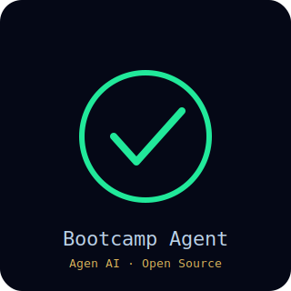
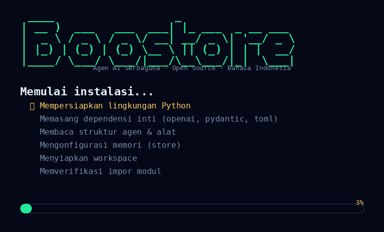

# Bootcamp Agent



**Contoh instalasi agen (animasi):**



**Framework agen AI serbaguna yang ringan, berbasis open-source, dan ditulis dalam Bahasa Indonesia.**

Bootcamp Agent adalah kerangka agen AI yang ringkas namun lengkap: agen dapat
berpikir, memanggil alat (tools), dan menyelesaikan tugas secara mandiri — mulai
dari menulis & menjalankan kode, mengedit berkas, mengeksekusi shell, hingga
menjelajah web. Dirancang agar mudah dibaca dan dipelajari, tanpa konfigurasi
berat.

---

## Apa itu Bootcamp Agent?

Bootcamp Agent adalah **framework agen AI serbaguna yang ringkas dan mudah
dibaca**. Ia mengambil pola agen modern (Think → Act → Observe) dan
menyederhanakannya agar siapa pun bisa memahami dan memodifikasinya secara
mandiri — tanpa ketergantungan pada framework lain.

- Loop agen berbasis langkah (ReAct)
- Pemanggilan alat (tool-calling) via OpenAI-compatible API
- Kumpulan alat bawaan: Python, Bash, editor berkas, web fetch, browser, tanya-human
- Mode multi-agensi (Supervisor) opsional
- Memori pluggable (dalam-memori / SQLite)
- Setup nol-config lewat environment variable

---

## Fitur utama

- **Satu file, satu tanggung jawab.** Setiap modul kecil dan berdiri sendiri.
- **OpenAI-compatible.** Pakai provider AI apa pun (OpenAI, NVIDIA, Together, dsb).
- **Setup mudah.** Jalankan `python main.py --setup` atau cukup set 3 environment variable.
- **Multi-agensi.** Mode `--multi` merutekan tugas ke sub-agensi terspesialisasi.
- **Portabel.** Berjalan di VPS, laptop, maupun Termux (Android).
- **Bot Discord/Telegram.** Relay bawaan untuk mengendalikan agen dari chat.

---

## Struktur proyek

```
Bootcamp-Agent/
├── main.py                 # titik masuk CLI
├── pyproject.toml
├── requirements.txt
├── requirements-bot.txt    # hanya untuk relay Discord/Telegram
├── Dockerfile              # image runtime bot (sandbox)
├── app/
│   ├── __init__.py
│   ├── config.py           # pemuat konfigurasi TOML + override env
│   ├── llm.py              # pembungkus AsyncOpenAI
│   ├── logger.py
│   ├── schema.py           # pesan, memori, status agen
│   ├── exceptions.py
│   ├── store.py            # memori pluggable (memory / sqlite)
│   ├── setup.py            # wizard setup interaktif
│   ├── agent/
│   │   ├── base.py         # BaseAgent (loop langkah)
│   │   ├── react.py        # ReActAgent (think/act)
│   │   ├── toolcall.py     # ToolCallAgent (pemanggilan alat)
│   │   ├── bootcamp.py     # Bootcamp (agen serbaguna default)
│   │   └── multi.py        # Supervisor + sub-agensi (coding/research/browser)
│   ├── prompt/
│   │   ├── bootcamp.py     # prompt sistem Bootcamp
│   │   ├── toolcall.py     # prompt sistem tool-calling
│   │   └── supervisor.py   # prompt supervisor + sub-agensi
│   ├── sandbox.py          # kebijakan keamanan (batasi shell/python/jaringan)
│   └── tool/
│       ├── base.py         # BaseTool + ToolResult
│       ├── tool_collection.py
│       ├── python_execute.py
│       ├── bash.py
│       ├── str_replace_editor.py
│       ├── webfetch.py     # fetcher web ringan tanpa browser
│       ├── browser.py      # browser Playwright (opsional)
│       ├── ask_human.py
│       ├── terminate.py
│       └── create_chat_completion.py
├── bot/
│   ├── run_bot.py          # relay Discord/Telegram
│   └── README.md
├── config/
│   └── config.example.toml
├── scripts/
│   └── make_demo_gif.py
├── tests_offline.py        # tes tanpa API
└── workspace/              # direktori kerja agen
```

---

## Cara instalasi

```bash
git clone https://github.com/Celebez/Bootcamp-Agent.git
cd Bootcamp-Agent
bash install.sh        # pasang dependensi + tampilkan animasi instalasi
```

Atau manual:
```bash
python -m venv .venv && source .venv/bin/activate
pip install -r requirements.txt
python scripts/install_anim.py   # jalankan animasi sambutan kapan pun
```

### Konfigurasi

**Opsi A — Setup interaktif:**
```bash
python main.py --setup
```

**Opsi B — Environment variable (zero-config):**
```bash
export OML_BASE_URL="https://api.openai.com/v1"
export OML_API_KEY="sk-..."
export OML_MODEL="gpt-4o"
python main.py
```

Atau salin `config/config.example.toml` → `config/config.toml` lalu isi manual.

---

## Cara menggunakan

```bash
# Mode agen tunggal (default)
python main.py
> Tulis fib.py, jalankan, lalu simpan hasilnya

# Lewati prompt interaktif
python main.py -p "Hitung bilangan prima kurang dari 100"

# Mode multi-agensi (Supervisor merutekan ke sub-agensi)
python main.py --multi -p "Cari berita terbaru tentang AI lalu rangkum"
```

### Dari kode Python

```python
import asyncio
from app.agent.bootcamp import Bootcamp

async def main():
    agent = Bootcamp()
    result = await agent.run("Buat berkas halo.txt berisi 'Halo Dunia'")
    print(result)
    await agent.cleanup()

asyncio.run(main())
```

---

## Alat bawaan (tools)

| Alat | Kegunaan |
|------|----------|
| `python_execute` | Menjalankan kode Python dalam subproses terbatas |
| `bash` | Menjalankan perintah shell |
| `str_replace_editor` | Membaca/membuat/mengedit berkas di workspace |
| `web_fetch` | Mengambil halaman web/API (ringan, tanpa browser) |
| `browser` | Mengotomasi browser sungguhan (Playwright) — opsional |
| `ask_human` | Bertanya ke pengguna (mode interaktif) |
| `terminate` | Mengakhiri jalannya agen dan melaporkan hasil |

---

## Mode multi-agensi (Supervisor)

Gunakan `--multi` untuk mengaktifkan Supervisor. Ia akan merutekan setiap
langkah ke sub-agensi yang paling cocok:

- **coding_agent** — menulis & menjalankan kode, shell
- **research_agent** — menjelajah web & merangkum
- **browser_agent** — mengendalikan browser sungguhan

```bash
python main.py --multi -p "Ambil screenshot beranda example.com lalu jelaskan"
```

---

## Keamanan (penting)

Bootcamp Agent adalah **agen yang dapat mengeksekusi kode dan perintah secara
arbitrer** atas nama model AI. Ini berarti:

- `python_execute` menjalankan kode Python apa pun.
- `bash` menjalankan perintah shell apa pun.
- `web_fetch` / `browser` dapat mengakses URL mana pun (risiko SSRF ke jaringan
  internal / metadata cloud bila diekspos ke jaringan terbuka).

**Sangat disarankan** mengaktifkan sandbox di `config.toml` (atau env):

```toml
[sandbox]
mode = "enforce"          # "off" | "warn" | "enforce"
timeout = 300
allow_private_net = false
```

Mode `enforce` memblokir (fail-closed):
- perintah shell berbahaya (`rm -rf /`, `mkfs`, `dd if=`, dll.),
- akses ke host pribadi (`localhost`, `127.0.0.1`, `169.254.169.254`, dll.),
- pemanggilan Python berisiko (`os.system`, `subprocess`, `socket`, dll.).

Lewati via env: `OML_SANDBOX_MODE=enforce OML_SANDBOX_ALLOW_PRIVATE=0`.

Jika Anda menjalankan relay bot di produksi, selalu setel `OML_PROD=1` beserta
daftar-izin (`ALLOWED_DISCORD_GUILDS` / `ALLOWED_TELEGRAM_USERS`) agar bot tidak
terbuka untuk siapa saja.

---

## Menjalankan di Termux (Android)

Bootcamp Agent berjalan baik di ponsel Android via **Termux**:

```bash
pkg install python
pip install -r requirements.txt
export OML_NO_BROWSER=1   # gunakan web_fetch ringan (tanpa Chromium)
python main.py
```

---

## Relay Bot Discord / Telegram

```bash
pip install -r requirements-bot.txt
export DISCORD_BOT_TOKEN="..."      # kosongkan untuk nonaktifkan
export TELEGRAM_BOT_TOKEN="..."     # kosongkan untuk nonaktifkan
export OML_MODE="single"            # "single" atau "multi"
python bot/run_bot.py
```

Di produksi, setel `OML_PROD=1` dan minimal satu daftar-izin
(`ALLOWED_DISCORD_GUILDS` / `ALLOWED_TELEGRAM_USERS`) agar bot tidak terbuka
untuk siapa saja.

---

## Demo & pembuktian

Jalankan agen secara end-to-end **tanpa API** (menggunakan LLM palsu) untuk
melihat tampilan CLI:

```bash
python scripts/demo_cli.py      # jalankan Bootcamp (tunggal) + Supervisor (multi)
python scripts/make_screenshot.py   # hasilkan proof_cli.png (tangkapan layar CLI)
```

Bukti tampilan:
- `proof_cli.png` — output CLI saat agen menjalankan kode & menyelesaikan tugas
- `proof_install.png` — animasi layar instalasi ala Hermes
- `demo_run.txt` — rekaman teks jalannya demo

---

## Lisensi

MIT — bebas digunakan, dimodifikasi, dan disebarluaskan. Lihat berkas `LICENSE`.

---

Dibuat dengan ❤️ oleh [Celebez](https://github.com/Celebez).
